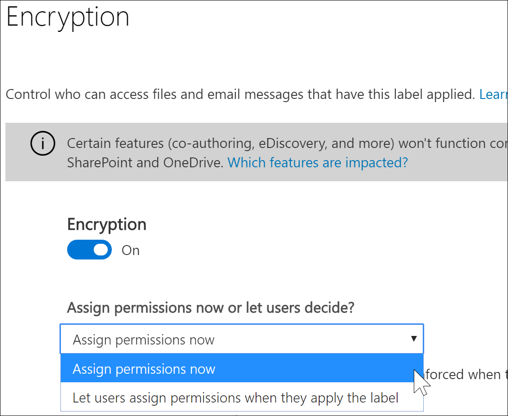
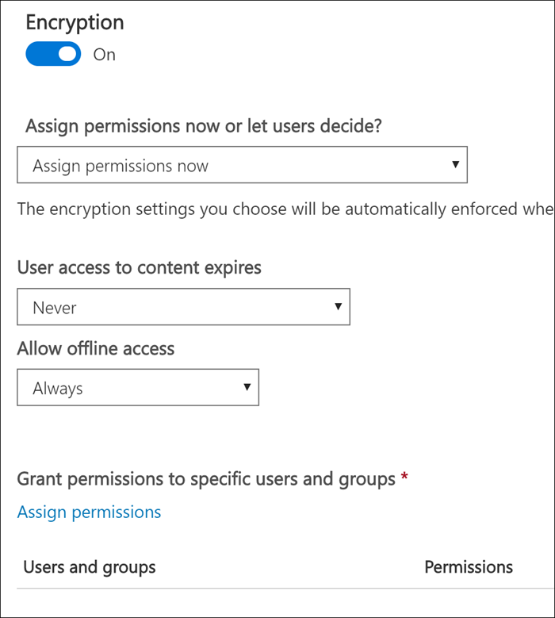
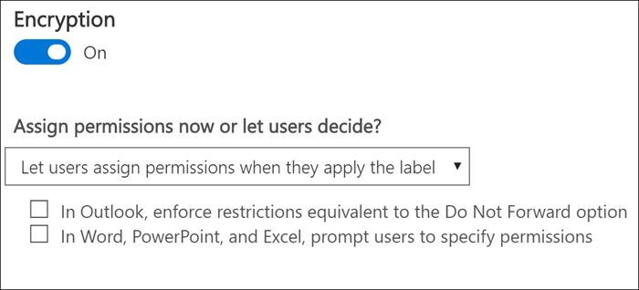
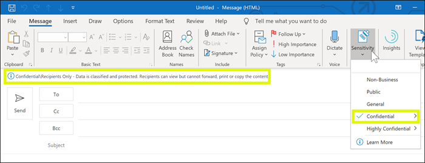
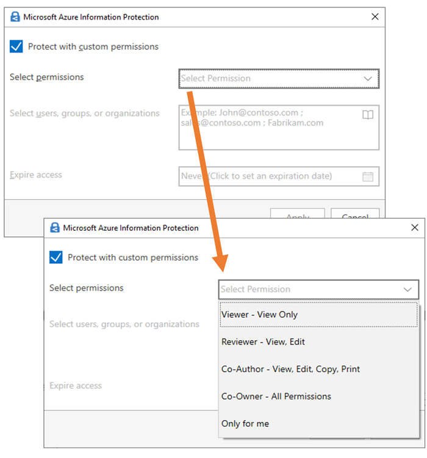

# Restrict access to content by using encryption in sensitivity labels

When you create a sensitivity label, you can restrict access to content that the label will be applied to. For example, with the encryption settings for a sensitivity label, you can protect content so that:

- Only users within your organization can open a confidential document or email.
- Only users in the marketing department can edit and print the promotion announcement document or email, while all other users in your organization can only read it.
- Users cannot forward an email or copy information from it that contains news about an internal reorganization.
- The current price list that is sent to business partners cannot be opened after a specified date.

When a document or email is encrypted, access to the content is restricted, so that it:

- Can be decrypted only by users authorized by the label’s encryption settings.
- Remains encrypted no matter where it resides, inside or outside your organization, even if the file’s renamed.
- Is encrypted both at rest (for example, in a OneDrive account) and in transit (for example, a sent email).

Finally, as an admin, when you create a sensitivity label, you can choose either to:

- **Assign permissions now**, so that you can determine exactly which users get which permissions to content with that label.
- **Let users assign permissions** when they apply the label to content. This way, you can allow people in your organization some flexibility that they might need to collaborate and get their work done.

The encryption settings are available when you create a sensitivity label in the Microsoft 365 compliance center, Microsoft 365 security center, or Office 365 Security & Compliance Center. In the left nav, choose **Classification** > **Sensitivity label** > **Create a label**.

## How encryption works

Encryption uses Azure Rights Management (Azure RMS). Azure RMS uses encryption, identity, and authorization policies. To learn more, see [What is Azure Rights Management?](https://docs.microsoft.com/en-us/azure/information-protection/what-is-azure-rms)

## How to turn on encryption for a sensitivity label

To begin, simply toggle **Encryption** to **On**, and then choose whether to:

- **Assign permissions now**, so that you can determine exactly which users get which permissions to content with that label. For more information, see the next section [Assign permissions now](#assign-permissions-now).
- **Let users assign permissions** when they apply the label to content. This way, you can allow people in your organization some flexibility that they might need to collaborate and get their work done. For more information, see the below section [Let users assign permissions](#let-users-assign-permissions).

For example, if you have a sensitivity label named **Highly Confidential** that will be applied to your most sensitive content, you may want to decide now who gets what type of permissions to that content.

Alternatively, if you have a sensitivity label named **Business Contracts**, and your organization's workflow requires that your people collaborate on this content with different people on an ad hoc basis, you may want to allow your users to decide who gets permissions when they assign the label. This flexibility both helps your users' productivity and reduces the requests for your admins to update or create new sensitivity labels to address specific scenarios.

## Assign permissions now

Use the options below to control who can access email or documents to which this label is applied. You can:

1. **Apply encryption to both email and documents, or just email.** If you choose just email, messages with this label will be encrypted in Outlook, but documents with this label won't be encrypted in other apps, such as Word or PowerPoint. 
2. **Allow access to labeled content to expire**, either on a specific date or after a specific number of days after the label is applied. After this time, users won’t be able to open the labeled item. If you specify a date, it is effective midnight on that date in your current time zone. (Note that some email clients may not enforce expiration and show emails past their expiration date, due to their caching mechanisms.)
3. **Allow offline access** never, always, or for a specific number of days after the label is applied. If you restrict offline access to never or a number of days, when that threshold is reached, users must be reauthenticated and their access is logged. For more information, see the next section on the Rights Management use license.

### Rights Management use license for offline access

When a user opens a document or email offline that’s been protected by a sensitivity label, an Azure Rights Management use license for that content is granted to the user. This use license is a certificate that contains the user's usage rights for the document or email, and the encryption key that was used to encrypt the content. The use license also contains an expiration date if this has been set, and how long the use license is valid.

If no expiration date has been set, the default use license validity period for a tenant is 30 days. For the duration of the use license, the user is not reauthenticated or reauthorized for the content. This lets the user continue to open the protected document or email without an Internet connection. When the use license validity period expires, the next time the user accesses the protected document or email, the user must be reauthenticated and reauthorized.

In addition to reauthentication, the policy and user group membership is reevaluated. This means that users could experience different access results for the same document or email if there are changes in the policy or group membership from when they last accessed the content.

To learn how to change the default 30-day setting, see [Rights Management use license](https://docs.microsoft.com/en-us/azure/information-protection/configure-usage-rights#rights-management-use-license).

### Assign permissions to specific users or groups

You can grant permissions to specific people so that only they can interact with the labeled content.

Doing so is a straightforward two-step process:

1. First you add users or groups that will be assigned permissions to the labeled content.
2. Then you choose which permissions those users have for the labeled content.

#### Add users or groups

When you assign permissions, you can choose:

- Everyone in your organization (all tenant members). This setting excludes guest accounts.
- Any specific user or email-enabled security group, distribution group, Office 365 group, or dynamic distribution group. 
- Any email address or domain outside your organization, such as gmail.com, hotmail.com, or outlook.com.

When you choose all tenant members or browse the directory, the users or groups must have an email address.

As a best practice, use groups rather than users. This strategy keeps your configuration simpler.

#### Choose permissions

When you choose which permissions to allow for those users or groups, you can select either:

- A [predefined permissions level](https://docs.microsoft.com/en-us/azure/information-protection/configure-usage-rights#rights-included-in-permissions-levels) with a preset group of rights, such as Co-Author or Reviewer.
- A Custom group of rights, where you choose whichever permissions you want.

For more information on each specific permission, see [Usage rights and descriptions](https://docs.microsoft.com/en-us/azure/information-protection/configure-usage-rights#usage-rights-and-descriptions).  

Note that the same label can grant different permissions to different users. For example, a single label can assign some users as Reviewer and a different user as Co-author, as shown below.

To do this, add users or groups, assign them permissions, and save those settings. Then repeat these steps, adding users and assigning them permissions, saving the settings each time. You can do this as often as necessary, to define different permissions for different users.

#### Rights Management issuer (user applying the sensitivity label) always has Full Control

Encryption for a sensitivity label uses Azure RMS. When a user applies a sensitivity label to protect a document or email by using Azure RMS, that user becomes the Rights Management issuers for that content.

The Rights Management issuer is always granted Full Control permissions for the document or email, and in addition:

- If the protection settings include an expiration date, the Rights Management issuer can still open and edit the document or email after that date.
- The Rights Management issuer can always access the document or email offline.
- The Rights Management issuer can still open a document after it is revoked.

For more information, see [Rights Management issuer and Rights Management owner](https://docs.microsoft.com/en-us/azure/information-protection/configure-usage-rights#rights-management-issuer-and-rights-management-owner).

## Let users assign permissions

You can use these options to let users assign permissions when they manually apply a sensitivity label to content:

- In Outlook, a user can enforce restrictions equivalent to the **Do Not Forward** option. This option is supported natively in Outlook on Windows, and does not require you to install the Azure Information Protection unified labeling client.
- In Word, PowerPoint, and Excel, a user is prompted to select a permission level for specific users, groups, or organizations. This option is not supported natively in these Office apps, so your users must install the Azure Information Protection unified labeling client.

These options determine in which apps the sensitivity label will appear:

- If the sensitivity label has only the Outlook option enabled, the label will appear to users only in Outlook.
- If the sensitivity label has only the Word, PowerPoint, and Excel option enabled, the label will appear to users only in those apps.
- If the sensitivity label has both options enabled, the label will appear to users in all of the available apps: Outlook, Word, PowerPoint, and Excel.

A sensitivity label that lets users assign permissions can be applied to content only manually by users; it can't be auto-applied or used as a recommended label.

> [!NOTE]
> Letting users assign permissions requires an Azure Information Protection subscription. To use this feature in Word, PowerPoint, and Excel, you must download and install the [Azure Information Protection unified labeling client](https://docs.microsoft.com/azure/information-protection/rms-client/install-unifiedlabelingclient-app). We're working on native support for this feature in these Office apps, so that they won't require the Azure Information Protection client. Also, the client runs only on Windows, so this feature is not yet supported on Mac, iOS, Android, or Office for the web.

### Outlook restrictions

In Outlook, when a user applies a sensitivity label that lets them assign permissions to a message, the restrictions are the same as the Do Not Forward option. The user will see the label name and description at the top of the message, which indicates the content's being protected. Unlike Word, PowerPoint, and Excel (see the [next section](#word-powerpoint-and-excel-permissions)), users aren't prompted to select specific permissions.

When the Do Not Forward option is applied to an email, the email is encrypted and recipients must be authenticated. Then, the recipients cannot forward it, print it, or copy from it. For example, in the Outlook client, the Forward button is not available, the Save As and Print menu options are not available, and you cannot add or change recipients in the To, Cc, or Bcc boxes.

Unprotected Office documents that are attached to the email automatically inherit the same restrictions. The usage rights applied to these documents are Edit Content, Edit; Save; View, Open, Read; and Allow Macros. If the user wants different usage rights for an attachment, or the attachment is not an Office document that supports this inherited protection, the user needs to protect the file before attaching it to the email.

### Word, PowerPoint, and Excel permissions

In Word, PowerPoint, and Excel, when a user applies a sensitivity label that lets them assign permissions to a document, they are prompted to protect the content as shown below.

The user can:

- Select a permission level, such as Viewer (which assigns View Only permission) or Co-Author (which assigns View, Edit, Copy, and Print permissions).
- Select users, groups, or organizations. This can include people both inside or outside your organizations.
- Set an expiration date, after which the selected users cannot access the content. For more information, see the above section [Rights Management use license for offline access](#rights-management-use-license-for-offline-access).

## What happens to existing encryption when a label's applied

Before a sensitivity label is applied to content, it's possible that a user already encrypted the content by applying some other protection setting. For example, a user might have applied:

- The **Do Not Forward** option.
- Custom protection by using the Azure Information Protection unified labeling client.
- An Azure Rights Management Service (RMS) template that encrypts the content but is not associated with a label.

This table describe what happens to existing encryption when a sensitivity label is applied to that content.
 
 

| |**User applies a sensitivity label with encryption turned off**|**User applies a sensitivity label with encryption turned on**|**User applies a label with Remove Protection**1|
|:-----|:-----|:-----|:-----|
|**Do Not Forward**|Email - Protection is removed Document - Protection is preserved|Label protection is applied|**Do Not Forward** is removed|
|**Custom protection**1|Protection is preserved|Label protection is applied|Custom protection is removed|
|**Azure RMS template**|Protection is preserved|Label protection is applied|Custom protection is removed|

1This is supported only in the Azure Information Protection labeling client.

## Storing encrypted content in OneDrive and SharePoint

Be aware that when encryption is applied to files stored in OneDrive and SharePoint, the service cannot process the contents of these files. This means that features such as co-authoring, eDiscovery, search, Delve, and other collaborative features do not work. Also, data loss prevention (DLP) policies can work only with the metadata (including Office 365 labels) but not the contents of encrypted files (such as credit card numbers within files).

This applies only to content stored in OneDrive and SharePoint. In Exchange Online, mail flow rules (also known as transport rules) use the [super user account](https://docs.microsoft.com/en-us/azure/information-protection/configure-super-users) so that they can scan encrypted content and enforce DLP policies.

## Important prerequisites

Before you can use encryption, you might need to perform these tasks.

### Activating Azure Rights Management

To use encryption in sensitivity labels, the Azure Rights Management service needs to be activated in your tenant. In newer tenants, the service is on by default, but you might need to manually activate the service. For more information, see [Activating Azure Rights Management](https://docs.microsoft.com/en-us/azure/information-protection/activate-service).

### Configure Exchange for Azure Information Protection

Exchange does not have to be configured for Azure Information Protection before users can apply labels in Outlook to protect their emails. However, until Exchange is configured for Azure Information Protection, you do not get the full functionality of using Azure Rights Management protection with Exchange.
 
For example, users cannot view protected emails on mobile phones or with Outlook on the web, protected emails cannot be indexed for search, and you cannot configure Exchange Online DLP for Rights Management protection. 

To ensure that Exchange can support these additional scenarios, see the following:

- For Exchange Online, see the instructions for [Exchange Online: IRM Configuration](https://docs.microsoft.com/en-us/azure/information-protection/configure-office365#exchange-online-irm-configuration).
- For Exchange on-premises, you must deploy the [RMS connector and configure your Exchange servers](https://docs.microsoft.com/en-us/azure/information-protection/deploy-rms-connector). 
