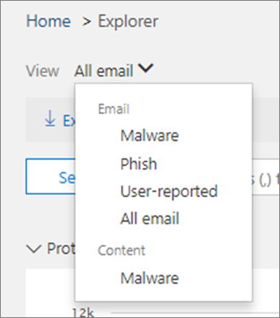
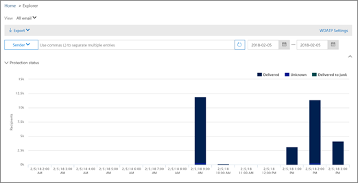
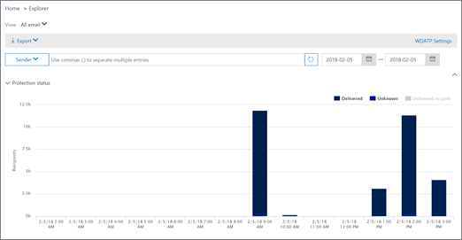
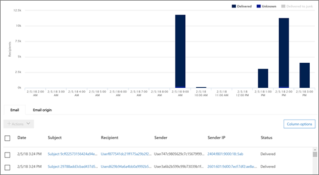
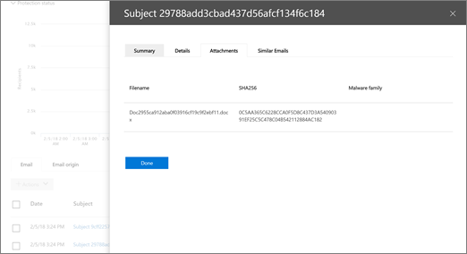
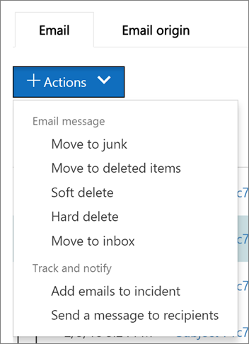

# Find and investigate malicious email that was delivered in Office 365

[Office 365 Advanced Threat Protection](office-365-atp.md) enables you to investigate activities that put your users at risk and take action to protect your organization. For example, if you are part of your organization's security team, you can find and investigate suspicious email messages that were delivered to your users. You can do this by using [Threat Explorer (or real-time detections)](threat-explorer.md).
  
## Before you begin...

Make sure that the following requirements are met:
  
- Your organization has [Office 365 Advanced Threat Protection](office-365-atp.md) and [licenses are assigned to users](https://docs.microsoft.com/en-us/office365/admin/subscriptions-and-billing/assign-licenses-to-users).
    
- [Office 365 audit logging](turn-audit-log-search-on-or-off.md) is turned on for your organization. 
    
- Your organization has policies defined for anti-spam, anti-malware, anti-phishing, and so on. See [Protect against threats in Office 365](protect-against-threats.md).
    
- You are an Office 365 global administrator, or you have either the Security Administrator or the Search and Purge role assigned in the Security &amp; Compliance Center. See [Permissions in the Office 365 Security &amp; Compliance Center](permissions-in-the-security-and-compliance-center.md).
    
## Dealing with suspicious emails

Malicious attackers may be sending mail to your users to try and phish their credentials and gain access to your corporate secrets! To prevent this, you should use the threat protection services in Office 365, including [Exchange Online Protection](eop/exchange-online-protection-overview.md) and [Advanced Threat Protection](office-365-atp.md). However, there are times when an attacker could send mail to your users containing a URL and only later on make that URL point to malicious content (malware, etc.). Alternately, you may realize too late that a user in your organization has been compromised, and while that user was compromised, an attacker used that account to send email to other users in your company. As part of cleaning up both of these scenarios, you may want to remove email messages from user inboxes. In situations like these, you can leverage [Threat Explorer (or real-time detections)](threat-explorer.md) to find and remove those email messages!

## Where re-routed emails are located after actions are taken

Threat Explorer real-time detections has added the Delivery Action and Delivery Location fields in the place of Delivery Status. This results in a more complete picture of where your emails land. Part of the goal of this change is to make hunting easier for Security Ops people, but the net result is knowing the location of problem emails at a glance.

Delivery Status is now broken out into two columns:

- **Delivery action** - What is the status of this email?
- **Delivery location** - Where was this email routed as a result?

Delivery action is the action taken on an email due to existing policies or detections. Here are the possible actions an email can take:

- **Delivered** – email was delivered to inbox or folder of a user and the user can directly access it.
- **Junked** – email was sent to either user’s junk folder or deleted folder, and the user has access to emails in their Junk or Deleted folder.
- **Blocked** – any emails that's quarantined, that  failed, or was dropped. This is completely inaccessible by the user!
- **Replaced** – any email where malicious attachments are replaced by .txt files that state the attachment was malicious.
 
Delivery location shows the results of policies and detections that run post-delivery. It's linked to a Delivery Action. This field was added to give insight into the action taken when a problem mail is found. Here are the possible values of delivery location:

- **Inbox or folder** – The email is in inbox or a folder (according to your email rules).
- **On-prem or external** – The mailbox doesn’t exist on cloud but is on -premises.
- **Junk folder** – The email in in the Junk folder of a user.
- **Deleted items folder** – The email in the Deleted items folder of a user.
- **Quarantine** – The email in quarantine, and is not in a user’s mailbox.
- **Failed** – The email failed to reach the mailbox.
- **Dropped** – The email gets lost somewhere in the Mailflow.
  
## Find and delete suspicious email that was delivered

> [!TIP]
> Threat Explorer (sometimes called Explorer), is a powerful report that can serve multiple purposes, such as finding and deleting messages, identifying the IP address of a malicious email sender, or starting an incident for further investigation. The following procedure focuses on using Explorer to find and delete malicious email from recipients mailboxes.

To see the changes to the former Delivery Status field (now Delivery Action and Delivery Location): 

1. Go to [https://protection.office.com](https://protection.office.com) and sign in using your work or school account for Office 365. This takes you to the Security &amp; Compliance Center. 
    
2. In the left navigation, choose **Threat management** \> **Explorer**.

You may notice the new 'Special actions' column in this graphic. This feature is aimed at telling admins the outcome of processing an email. Special actions may be updated at the end of Threat Explorer's *email timeline*, which is a new feature aimed at making the hunting experience better for admins.

Email timeline cuts down on randomization because there is less time spent checking different locations to try to understand events that happened since the email arrived. When multiple events happen at, or close to, the same time on an email, those events will show up in a timeline view. Some events that happen post-delivery to your mail will be captured in the 'Special actions' column. Combining the information from the *email timeline* of that mail with the *Special actions* taken on the mail post-delivery will give admins insight into how their policies work, where the mail was finally routed, and, in some cases, what the final assessment was. The Special actions column can be accessed in the same place as Delivery action and Delivery location, but to see an email timeline:

1. Click on the subject of the email.
2. On the panel that appears, click *Email timeline*. (It will appear among other headings on the panel like 'Summary' or 'Details', et cetera.)

Once you've opened the email timeline, you should see a table that tells you the post-delivery events for that mail, or, in the case of no further events for the email, you should see a single event for the original delivery that will state a result like *Blocked* with a verdict like *Phish*. The tab also has the option to export the entire email timeline, and this will export all the details on the tab and details on the email (things like Subject, Sender, Recipient, Network, and Message ID).

3. In the View menu, choose **All email**. 
  
4. Notice the labels that appear in the report, such as **Delivered**, **Unknown**, or **Delivered to junk**.  (Depending on the actions that were taken on email messages for your organization, you might see additional labels, such as **Blocked** or **Replaced**.)
    
5. In the report, choose **Delivered** to view only emails that ended up in users' inboxes. 
  
6. Below the chart, review the **Email** list below the chart. 
  
7. In the list, choose an item to view more details about that email message. For example, you can click the subject line to view information about the sender, recipients, attachments, and other similar email messages. 
  
8. After viewing information about email messages, select one or more items in the list to activate **+ Actions**.
    
9. Use the **+ Actions** list to apply an action, such as **Move to deleted** items. This will delete the selected messages from the recipients' mailboxes. 
  
## Related topics

[Office 365 Advanced Threat Protection Plan 2](office-365-ti.md)
  
[Protect against threats in Office 365](protect-against-threats.md)
  
[View reports for Office 365 Advanced Threat Protection](view-reports-for-atp.md)
  

