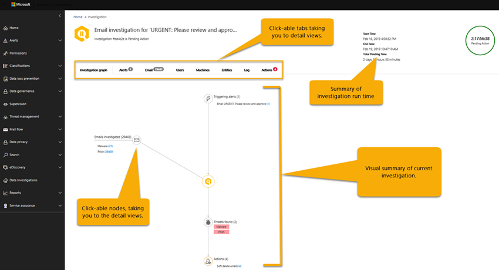

# Automatically investigate and respond to threats in Office 365

[Office 365 Advanced Threat Protection](office-365-atp.md) Plan 2 includes automated investigation and response (AIR) capabilities. These capabilities can save your security operations team time and effort in dealing with alerts and threats. With AIR, when certain alerts are triggered, one or more security playbooks initiate, and automated investigation begins. During and after an automated investigation process, your administrators and security operations team can view the results and review/approve pending actions. Read this article to get started using AIR capabilities in Office 365. To learn more about how AIR works, see [Automated Investigation and Response (AIR) with Office 365](automated-investigation-response-office.md).

## View details of an investigation

1. As an Office 365 global administrator, security administrator, or security reader, go to [https://protection.office.com](https://protection.office.com) and sign in. This takes you to the the Security & Compliance Center.

2. Do one of the following:

    - Go to **Threat management** > **Dashboard**. This takes you to the [Security Dashboard](security-dashboard.md). Your AIR widgets appear across the top of the [Security Dashboard](security-dashboard.md). Select a widget, such as **Investigations summary**.

    - Go to **Threat management** > **Investigations**. 

    Either method takes you to a list of investigations.

     

3. In the list of investigations, select an item in the **ID** column. This opens investigation details page, starting with the investigation graph.

    

4. Use the various tabs to learn more about the investigation.

## Review and approve actions

In Office 365, automated investigations typically result in one or more recommended actions. However, no actions are taken until they are approved by your security operations team.  

1. As an Office 365 global administrator, security administrator, or security reader, go to [https://protection.office.com](https://protection.office.com) and sign in. This takes you to the the Security & Compliance Center.

2. Go to **Threat management** > **Investigations**.

3. In the list of investigations, select an item in the **ID** column. 

3. On the investigation details view, select the **Actions** tab. Any actions that are pending approval are listed here.

4. Select an item in the list.

5. Select **Approve** to take the recommended action (or **Reject** to close the investigation without taking action).

## View details about an alert related to an investigation

1. As an Office 365 global administrator, security administrator, or security reader, go to [https://protection.office.com](https://protection.office.com) and sign in. This takes you to the the Security & Compliance Center.

2. Go to **Threat management** > **Investigations**.

3. In the list of investigations, select an item in the **ID** column. 

4. With details of an investigation open, select the **Alerts** tab. Any alerts that triggered the investigation are listed here.

5. Select an item in the list. A flyout opens, with details about the alert and links to additional information and actions.

6. Review the information on the flyout, and, depending on the particular alert, take an action, such as **Resolve**, **Suppress**, or **Notify users**. 

## Next steps

[Learn more about alerts](alert-policies.md)

[Learn about AIR in Microsoft Defender ATP](https://docs.microsoft.com/windows/security/threat-protection/microsoft-defender-atp/automated-investigations)

[Manually find and investigate malicious email that was delivered in Office 365](investigate-malicious-email-that-was-delivered.md)
