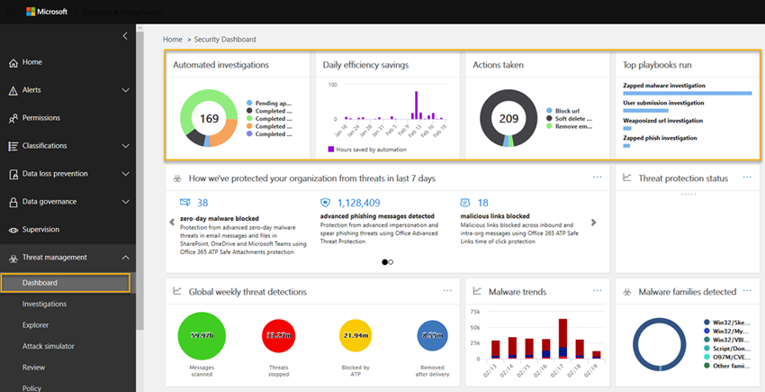

# Automatically investigate and respond to threats in Office 365

[Office 365 Advanced Threat Protection](office-365-atp.md) Plan 2 includes automated investigation and response (AIR) capabilities. These capabilities can save your security operations team time and effort in dealing with alerts and threats. With AIR, when certain alerts are triggered, one or more security playbooks initiate, and automated investigation begins. During and after an automated investigation process, your administrators and security operations team can view the results and review/approve pending actions. Read this article to get started using AIR capabilities in Office 365. 

To learn more about how AIR works, see [Automated Investigation and Response (AIR) with Office 365](automated-investigation-response-office.md).

## View pending actions

## View investigations

1. As an Office 365 global administrator, security administrator, or security reader, go to [https://protection.office.com](https://protection.office.com) and sign in. This takes you to the the Security & Compliance Center.

2. Do one of the following:

    - Go to **Alerts** > **View alerts**. Open one of the investigation-related alerts, and then click the **View investigation** link at the bottom of the alert flyout. 

    - Go to **Threat management** > **Investigations**. Select an item in the **ID** column.

    - Go to **Threat management** > **Dashboard**. This takes you to the [Security Dashboard](security-dashboard.md). Your AIR widgets appear across the top of the [Security Dashboard](security-dashboard.md). 

## Next steps

[Learn about AIR in Microsoft Defender ATP](https://docs.microsoft.com/windows/security/threat-protection/microsoft-defender-atp/automated-investigations)

[Manually find and investigate malicious email that was delivered in Office 365](investigate-malicious-email-that-was-delivered.md)
