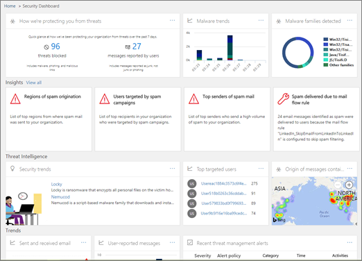
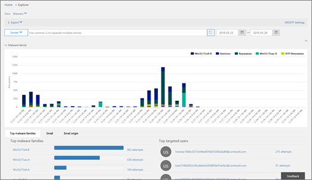
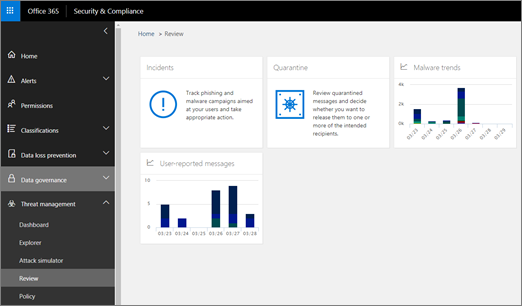
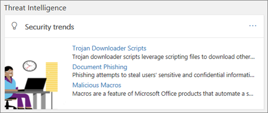

# Office 365 threat investigation and response

Threat investigation and response capabilities in [Office 365 Advanced Threat Protection](office-365-atp.md) help security analysts and administrators protect their organization's Office 365 users by:
  
- Making it easy to identify, monitor and understand attacks
    
- Helping to quickly address threats in Exchange Online, SharePoint Online, OneDrive for Business and Microsoft Teams
    
- Providing insights and knowledge to help prevent attacks against their organization

- Employing [automated investigation and response](automated-investigation-response-office.md) for critical email based threats
    
Read this article to learn more about threat investigation and response, and how to get started.
  
## Threat investigation and response in Office 365

Threat investigation and response capabilities help drive insights into threats and related response actions that are available in the Office 365 Security &amp; Compliance Center. These insights can help your organization's security team protect Office 365 users from email- or file-based attacks. The capabilities help monitor signals and gathers data from multiple sources, such as user activity, authentication, email, compromised PCs, and security incidents. Business decision makers and Office 365 global administrators, security administrators, and security analysts can all use this information to understand and respond to threats against Office 365 users and protect their intellectual property.

## Get acquainted with the Threat dashboard, Explorer, and Incidents

Threat investigation and response capabilities surface in the Security &amp; Compliance Center, as a set of tools and response workflows, including the [threat dashboard](#threat-dashboard), [Explorer](#threat-explorer), [Incidents](#incidents), [Attack Simulator](attack-simulator.md), and [Automated Investigation & Response](automated-investigation-response-office.md).
  
### Threat dashboard

Use the Threat dashboard (this is also referred to as the [Security dashboard](security-dashboard.md)) to quickly see what threats have been addressed, and as a visual way to report to business decision makers how Office 365 services are securing your business.
  

  
To view and use this dashboard, in the Security &amp; Compliance Center, go to **Threat management** \> **Dashboard**.
  
### Threat Explorer

Use [Threat Explorer (and real-time detections)](threat-explorer.md) to analyze threats, see the volume of attacks over time, and analyze data by threat families, attacker infrastructure, and more. Threat Explorer (also referred to as Explorer) is the starting place for any security analyst's investigation workflow.
  

  
To view and use this report, in the Security &amp; Compliance Center, go to **Threat management** \> **Explorer**.
  
### Incidents

Use the Incidents list (this is also called Investigations) to see a list of in flight security incidents. Incidents are used to track threats such as suspicious email messages, and to conduct further investigation and remediation.
  

  
To view the list of current incidents for your organization, in the Security &amp; Compliance Center, go to **Threat management** \> **Review** \> **Incidents**.
  

  
## Learn more about malware and threats

As part of the Office 365 Advanced Threat Protection Plan 2 offering, security analysts can review details about a known threat. This is useful to determine whether there are additional preventative measures/steps that can be taken to keep users safe.
  
 
  
## How do we get these capabilities?

Office 365 threat investigation and response capabilities are included in Office 365 Advanced Threat Protection Plan 2 and Enterprise E5. 

> [!TIP]
> If your organization has an Office 365 subscription that does not include these threat investigation and response capabilities, you can potentially purchase Office 365 Advanced Threat Protection Plan 2 as an add-on. For more information about plan options, see [Office 365 Advanced Threat Protection service description](https://docs.microsoft.com/en-us/office365/servicedescriptions/office-365-advanced-threat-protection-service-description) and [Buy or edit an add-on for Office 365 for business](https://docs.microsoft.com/office365/admin/subscriptions-and-billing/buy-or-edit-an-add-on).
  
1. As an Office 365 global administrator, go to [https://admin.microsoft.com](https://admin.microsoft.com) and sign in using your work or school account for Office 365. 
    
2. Choose **Admin** \> **Billing** to see what your current subscription includes. 
    - If you see **Office 365 Enterprise E5**, then your organization has Office 365 Advanced Threat Protection Plan 2 (which includes threat investigation and response capabilities). 
    - If you see a different subscription, such as **Office 365 Enterprise E3** or **Office 365 Enterprise E1**, consider adding Office 365 Advanced Threat Protection Plan 2. (To do that, choose **+ Add subscription**.)
    
3. In the Microsoft 365 admin center, choose **Users** \> **Active users**.
    
4. Assign Office 365 Advanced Threat Protection Plan 2 licenses to all active users. (Only users who have a license for this will show up in reports, such as Explorer.)
    
5. Assign roles to people in your organization who will be working with the Office 365 Advanced Threat Protection. See [Give users access to the Office 365 Security &amp; Compliance Center](grant-access-to-the-security-and-compliance-center.md), and refer to the following table: 

  |**To do this activity...**   |**You must have one of these roles**   |  
  |:-----|:-----|
  |Use the Threat dashboard (or the new [Security dashboard](security-dashboard.md))  View information about recent or current threats    |Office 365 Global Administrator    Security Administrator (assigned in the Security &amp; Compliance Center)    Security Reader (assigned in the Security &amp; Compliance Center)    |
  |Use [Threat Explorer (and real-time detections)](threat-explorer.md) to analyze threats    |Office 365 Global Administrator    Security Administrator (assigned in the Security &amp; Compliance Center)    Security Reader (assigned in the Security &amp; Compliance Center)    |
  |View Incidents (also referred to as Investigations)   Add email messages to an incident    |Office 365 Global Administrator    Security Administrator (assigned in the Security &amp; Compliance Center)    Security Reader (assigned in the Security &amp; Compliance Center)    |
  |Trigger email actions in an incident    Find and delete suspicious email messages    |Office 365 Global Administrator or Security Administrator    One of the roles above and Search and Purge (assigned in the Security &amp; Compliance Center)    |
  |Integrate Office 365 Advanced Threat Protection Plan 2 with Microsoft Defender ATP    Integrate Office 365 Advanced Threat Protection Plan 2 with a SIEM server    |Office 365 Global Administrator    Security Administrator (assigned in the Security &amp; Compliance Center)    Appropriate role assigned in additional applications (such as Microsoft Defender Security Center or a SIEM server)    |
   
For information about roles, role groups, and permissions, see [Permissions in the Office 365 Security &amp; Compliance Center](permissions-in-the-security-and-compliance-center.md).
    
## Next steps

- [Learn about Threat Trackers - New and Noteworthy](threat-trackers.md)
    
- [Find and investigate malicious email that was delivered (Office 365 Threat Investigation and Response)](investigate-malicious-email-that-was-delivered.md)
    
- [Integrate Office 365 Threat Investigation and Response with Microsoft Defender Advanced Threat Protection](integrate-office-365-ti-with-wdatp.md)
    
- [Learn about Attack Simulator](attack-simulator.md)
  

